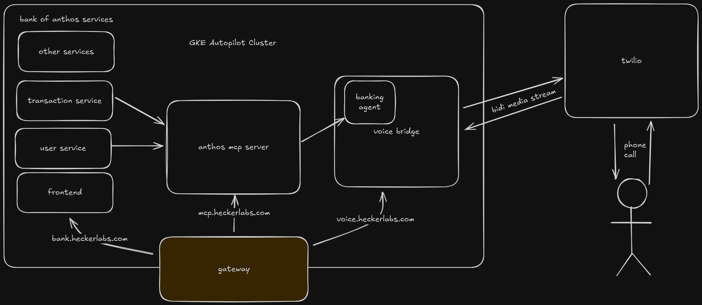

# live-agent

Phone agent that can respond to banking inquiries in real time.

## Deployment

This project uses GKE to deploy several services, including the Voice Bridge, MCP Server, and Bank of Anthos sample application. To deploy, follow the instructions in [`k8s/README.md`](./k8s/README.md).

## Architecture

Bank of Anthos Services, Anthos MCP, and Voice Bridge are all hosted in the GKE Cluster. Anthos Frontend, Anthos MCP, and Voice Bridge each have a gateway route which allows them to be accessed over the internet using HTTPS.

